

# Glass Ops

### Glazing repair management, from first report to completed repair

**ASP.NET Core · .NET MAUI · C# · Entity Framework Core · SQL Server**

[Explore the website](https://glassops.co.uk/) · [Register for a free demo](https://glassops.co.uk/Identity/Account/Register) · [Contact](mailto:contact@glassops.co.uk)

> **Repository under construction** — This repository is being developed as a showcase for Glass Ops. The application source code is not currently published here and can be requested by email.

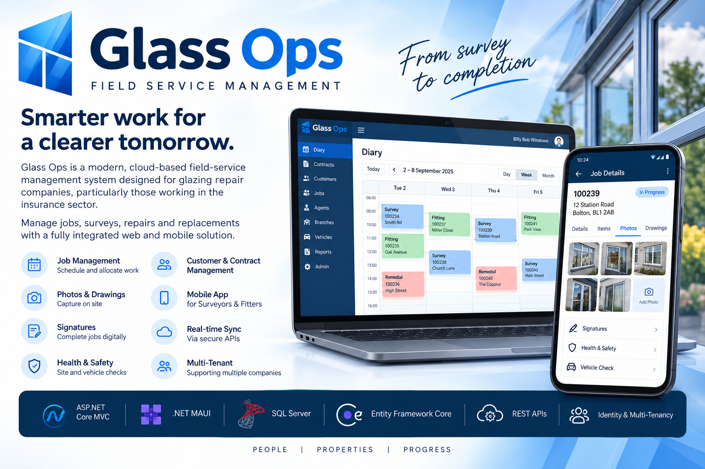

## What is Glass Ops?

[Glass Ops](https://glassops.co.uk/) is a glazing repair management platform designed around the day-to-day work of glazing companies, field operatives, customers and insurers. It brings together the journey from a reported incident through surveying, scheduling, fitting and remedial work.

The platform includes a web-based management system and mobile applications, with an emphasis on practical field workflows and keeping information connected between the office and operatives on site.

The project began as a personal development project, drawing on experience building software for the glazing repair industry. This repository is intended to demonstrate the platform and the technologies behind it.

## What it covers

- **Contracts and customers:** Manage customer information, reported damage, contracts and progress through the repair process.
- **Diary and job scheduling:** Organise survey, fitting and remedial appointments and assign work to field operatives.
- **Field operative app:** Receive jobs, record glazing survey details, capture photographs, videos, drawings and signatures, and work offline with server synchronisation.
- **Safety and vehicle checks:** Record health and safety, PPE, tool, ladder and vehicle checks.
- **Customer app:** Give customers access to their repair progress, appointments and updates.
- **Insurer workflows:** Support insurance claims, assignments, contract updates and a job board for glazing companies.
- **Company accounts:** Support separate company data and role-based access within the platform.

AI-assisted surveying is an area of potential future development; it is **not currently an integrated feature**.

## Screenshots

### Web management and job board

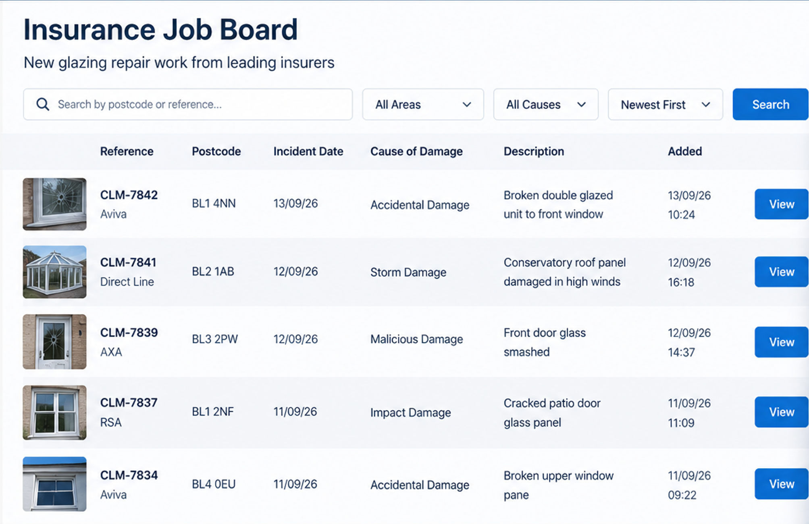

### Field operative app

The field app supports surveying, fitting and remedial work, including media capture and offline operation.

| | |
|:---:|:---:|
| 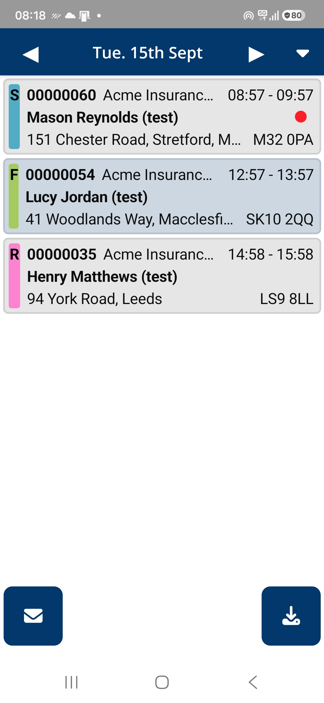 | 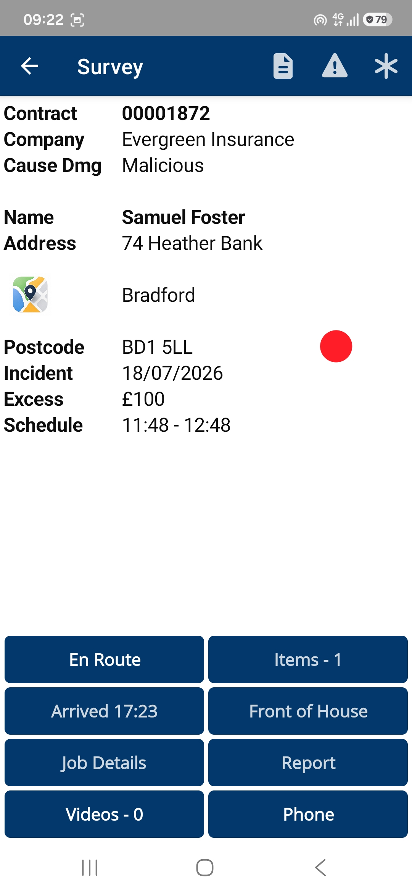 |
| 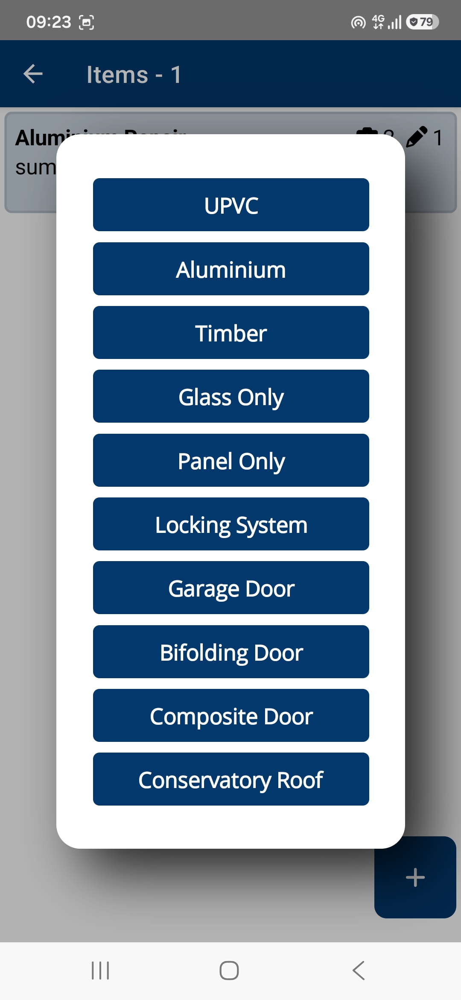 | 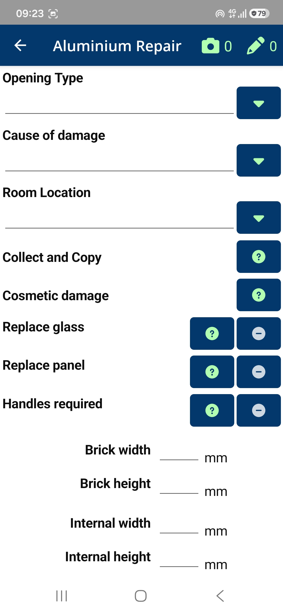 |

### Customer app

The customer app provides a view of repair progress, appointments and updates.

| | |
|:---:|:---:|
| 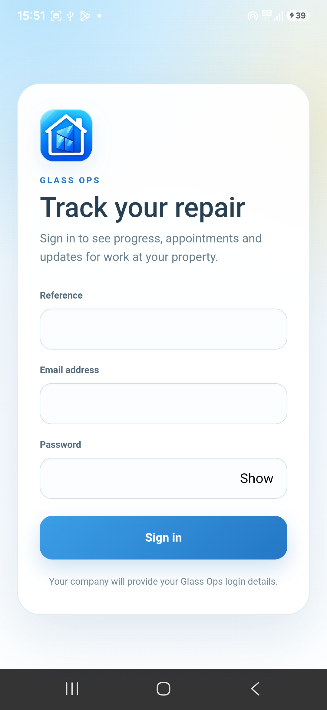 | 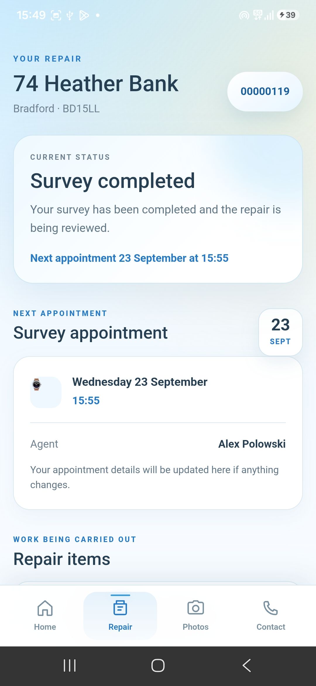 |
| 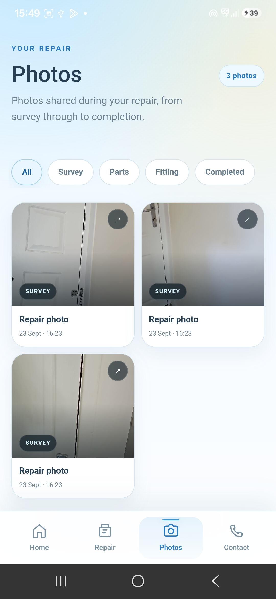 | 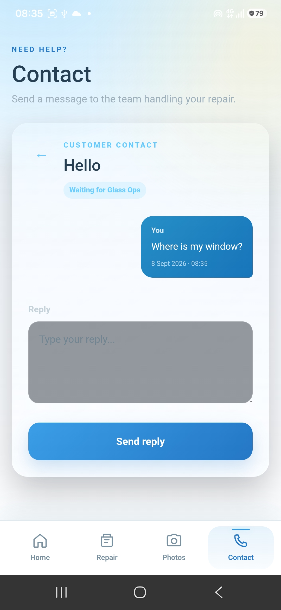 |

### Diary

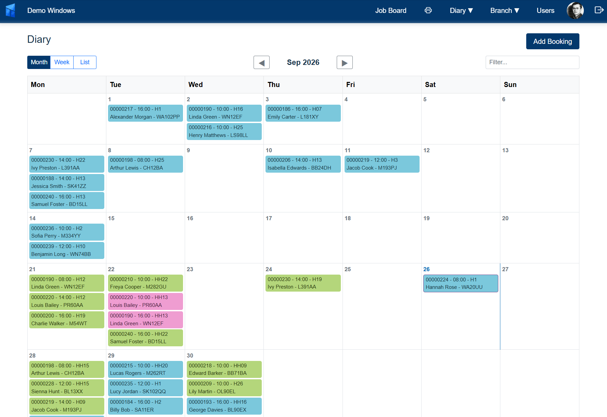

## Technology

Glass Ops is developed using:

- **C# and .NET** for the application code
- **ASP.NET Core MVC and REST APIs** for the web platform and communication with mobile apps
- **Entity Framework Core and SQL Server** for server-side data management
- **.NET MAUI** for the Android mobile applications
- **SQLite** for offline mobile data
- **ASP.NET Core Identity** for authentication and role-based access

The platform is designed to support multiple glazing companies with separate company data.

## Try the demonstration

The [Glass Ops website](https://glassops.co.uk/) provides information about the system and access to a demonstration environment. You can [register for a free demo](https://glassops.co.uk/Identity/Account/Register) and explore the available workflows.

Demo accounts can include fictional customers and contracts for testing. The demonstration environment is not intended for real customer, personal or commercially sensitive information, and test data may be periodically deleted.

## Source code and enquiries

This repository is currently a **showcase, not a source-code release**. If you would like to discuss Glass Ops, request access to the code or ask about the project, please contact:

**[contact@glassops.co.uk](mailto:contact@glassops.co.uk)**

Website: **[glassops.co.uk](https://glassops.co.uk/)**

---

*Glass Ops — a personal software development project for the glazing repair industry.*

